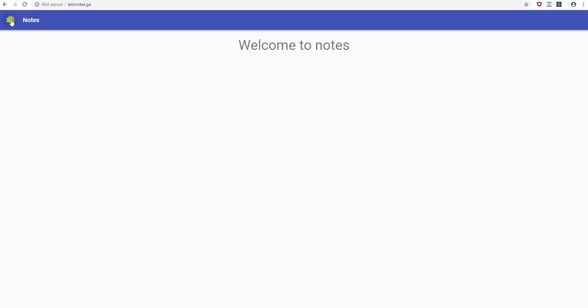

# Notes-react-app

> Note react application is developed for taking notes and save all to local storage

To install in your computer first download or clone the zip file then hit

```
# Install dependencies
npm install

# Serve on localhost:3000
npm start
```

[Preview note demo](http://letsnotes.ga/)

## Demo


